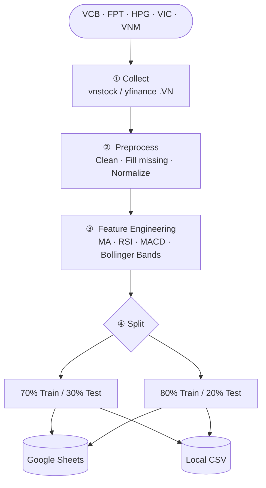

<h1 align="center">📈 Stock Time Series</h1>

<p align="center">
  <b>Vietnamese stock market data pipeline for time series forecasting research</b><br/>
  <i>Collect · Preprocess · Engineer Features · Split · Share</i>
</p>

<p align="center">
  
  
  
  
</p>

---

## Overview

Member 1's data pipeline for a group project on Vietnamese stock price forecasting.
Delivers clean, reproducible datasets that feed into six forecasting models built by other team members: ARIMA, SVR, LSTM, GRU, Prophet, and XGBoost/Transformer.

**Tickers:** `VCB` · `FPT` · `HPG` · `VIC` · `VNM` &nbsp;|&nbsp; **Period:** 2016 – 2026

---

## Environments

### Production — GitHub Actions (automated)

Runs automatically every weekday (Mon–Fri) at **4:00 PM Vietnam time** (after HOSE/HNX market close).
Results are pushed to **Google Sheets** — teammates open the link to get the latest data.

```
GitHub Actions (cron Mon–Fri 16:00 ICT)
    ↓  collect via yfinance (.VN)            → data/raw/             (bronze)
    ↓  clean OHLCV gaps + dedup              → data/processed/cleaned/   (silver)
    ↓  technical indicators (MA/RSI/MACD/BB) → data/processed/featured/  (gold)
    ↓  train/test split (70/30 and 80/20)
    ↓  validate splits (schema, row count, monotonic dates) — fail-fast
    ↓  walk-forward 5-fold benchmark (Linear Regression baseline)
    ↓  re-execute notebook 01 → refresh predictions in docs/data/
    ↓  aggregate_results.py → registry.json + chapter5_*.csv
    ↓     ↘ regression check: RMSE +20% vs champion → "regression_detected" event
    ↓  auto-commit docs/data/ + results/ → GitHub Pages auto-deploy
    ↓  upload → Google Sheets ✓
    ↓  on failure → Google Chat webhook (GOOGLE_CHAT_WEBHOOK_URL secret)
```

**Optional secrets** (configure in GitHub repo → Settings → Secrets → Actions):
- `GOOGLE_SERVICE_ACCOUNT_JSON`, `SHEETS_SPREADSHEET_ID` — Google Sheets upload
- `GOOGLE_CHAT_WEBHOOK_URL` — Google Chat space webhook for cron failure alerts.
  Get it from: target Space → ⋮ → *Apps & integrations* → *Manage webhooks* → *Add webhook*.

> **Google Sheets link:** [stock-time-series data](https://docs.google.com/spreadsheets/d/1p7yWv51McAEHGJ7KyD4j8H1CDXwuVcUOGT-pVKxcM_Q/edit?usp=sharing)

---

### Development — Run locally

Clone the repo and run the pipeline on your machine to generate CSV files under `data/processed/splits/`.

#### 1. Clone & set up the environment

```bash
git clone https://github.com/PhongNguyenTrung/stock-time-series.git
cd stock-time-series

python3 -m venv .venv
source .venv/bin/activate          # Windows: .venv\Scripts\activate
pip install -r requirements.txt
```

#### 2. Configure `.env`

```bash
cp .env.example .env
```

The defaults in `.env.example` are sufficient to run — no changes needed.

#### 3. Run the pipeline

```bash
# Standard local run (skips cloud uploads)
python scripts/run_pipeline.py --skip-upload --skip-sheets

# Force re-download of raw data
python scripts/run_pipeline.py --skip-upload --skip-sheets --force
```

The pipeline produces:

```
data/
├── raw/                          # Raw OHLCV             [git-ignored]
└── processed/
    ├── featured/                 # + indicators           [git-ignored]
    └── splits/
        ├── 70_30/
        │   ├── VCB_train.csv
        │   ├── VCB_test.csv
        │   └── ...               # 5 tickers × 2 files = 10 files
        ├── 80_20/
        │   └── ...               # 10 files
        └── split_info.json       # cut dates per ticker
```

#### 4. Load data in a notebook

```python
import pandas as pd
from pathlib import Path

SPLITS_DIR = Path("data/processed/splits")

train = pd.read_csv(SPLITS_DIR / "70_30/VCB_train.csv", parse_dates=["date"])
test  = pd.read_csv(SPLITS_DIR / "70_30/VCB_test.csv",  parse_dates=["date"])
```

---

## Pipeline



| Step | Module | Output |
|------|--------|--------|
| 1 · Collect (bronze) | `src/collect.py` | `data/raw/<TICKER>.csv` |
| 2 · Clean (silver) | `src/clean.py` | `data/processed/cleaned/<TICKER>.csv` |
| 3 · Features (gold) | `src/features.py` | `data/processed/featured/<TICKER>_featured.csv` |
| 4 · Split | `src/split.py` | `data/processed/splits/{70_30,80_20}/<TICKER>_{train,test}.csv` |
| 5 · Upload | `src/sheets.py` | Google Sheets (production only) |

---

## Dataset Schema

Columns in each `*_train.csv` / `*_test.csv` file:

| Column | Type | Description |
|--------|------|-------------|
| `date` | date | Trading date |
| `open` `high` `low` `close` | float | OHLC price (VND thousands) |
| `volume` | int | Matched trading volume |
| `ma_5` `ma_20` `ma_50` | float | Simple Moving Average |
| `rsi_14` | float | RSI (0–100) |
| `macd` `macd_signal` `macd_hist` | float | MACD (12, 26, 9) |
| `bb_upper` `bb_middle` `bb_lower` | float | Bollinger Bands (20, 2σ) |

**Split boundaries** (identical across all tickers):

| Split | Train end | Test start | Train rows | Test rows |
|-------|-----------|------------|------------|-----------|
| 70/30 | 2023-02-20 | 2023-02-21 | 1 853 | 795 |
| 80/20 | 2024-03-12 | 2024-03-13 | 2 118 | 530 |

---

## Notebooks

| Notebook | Purpose |
|----------|---------|
| `notebooks/00_template.ipynb` | **Members 2/3/4** — copy and fill in your model |
| `notebooks/01_linear_regression.ipynb` | Member 1 — Linear Regression with lag features |
| `notebooks/02_eda.ipynb` | Member 1 — Exploratory Data Analysis for Chapter 3 |

### Guide for Members 2, 3, 4

1. Copy `00_template.ipynb` and rename it (e.g. `02_arima_svr.ipynb`)
2. Set `MODEL_NAME`, implement `train_and_predict()` and `prepare_data()`
3. Run the notebook — results are saved automatically to `results/<model_name>/`
4. Send `results/<model_name>/<model_name>_results.csv` to Member 1

Required CSV format (optional column `Directional Accuracy (%)` is supported):
```
Ticker,Split,Model,RMSE,MAE,MAPE (%),R²,Directional Accuracy (%)
VCB,70_30,LSTM,0.85,0.60,1.02,0.96,54.3
...
```

To keep metric formulas identical across all 6 models, use the shared helper:

```python
from src.metrics import compute_metrics

# y_true, y_pred:  next-day close (test set, in original price space)
# prev_close:      same-day close (used for Directional Accuracy)
m = compute_metrics(y_true, y_pred, prev_close=prev_close)
rows.append({"Ticker": "VCB", "Split": "70_30", "Model": MODEL_NAME, **m})
```

### Aggregating results (Member 1 — Chapter 5)

Once all members have submitted their CSV files:

```bash
python scripts/aggregate_results.py
# → results/comparison/chapter5_comparison.csv
# → results/comparison/chapter5_pivot_rmse_*.csv
# → results/comparison/chapter5_walkforward_summary.csv  (if any *_walkforward.csv exist)
# → results/comparison/plots/
# → results/registry.json                                ← champion model + promotion history
```

### Walk-forward evaluation (Linear Regression baseline)

In addition to the 70/30 and 80/20 single splits, run a 5-fold expanding-window
`TimeSeriesSplit` benchmark — the academic standard for time-series CV:

```bash
python scripts/walkforward_eval.py
# → results/linear_regression/linear_regression_walkforward.csv          (per fold)
# → results/linear_regression/linear_regression_walkforward_summary.csv  (mean ± std)
```

The aggregator picks any `*_walkforward.csv` it finds under `results/`, so other
members can drop in their own walk-forward CSVs and they will be summarised in
`chapter5_walkforward_summary.csv`.

### Model registry — champion / promotion history

`results/registry.json` records the lowest-RMSE model per (Ticker, Split) and a
chronological log of promotion events. Updated automatically each time
`aggregate_results.py` runs. Useful for the "model evolution" narrative in
Chapter 5–6 of the report.

---

## Tech Stack

| Library | Purpose |
|---------|---------|
| [vnstock](https://github.com/thinh-vu/vnstock) | Vietnamese stock data |
| [yfinance](https://github.com/ranaroussi/yfinance) | Fallback data source |
| [pandas](https://pandas.pydata.org/) | Data manipulation |
| [ta](https://github.com/bukosabino/ta) | Technical indicators |
| [scikit-learn](https://scikit-learn.org/) | Linear Regression, StandardScaler |
| [statsmodels](https://www.statsmodels.org/) | ADF test, seasonal decomposition |
| [gspread](https://github.com/burnash/gspread) | Google Sheets API |

---

## License

MIT © [PhongNguyenTrung](https://github.com/PhongNguyenTrung)
