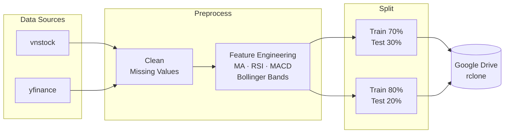

<h1 align="center">📈 Stock Time Series</h1>

<p align="center">
  <b>Vietnamese stock market data pipeline for time series forecasting research</b><br/>
  <i>Collect · Preprocess · Engineer Features · Split · Upload</i>
</p>

<p align="center">
  
  
  
  
</p>

---

## Overview

This repository is **Member 1's contribution** to a group research project on Vietnamese stock price forecasting. It delivers a clean, reproducible data pipeline that the entire team relies on as shared input.

**Tickers:** `VCB` · `FPT` · `HPG` · `VIC` · `VNM` &nbsp;|&nbsp; **Period:** 2016 – 2026

The pipeline output feeds directly into six forecasting models built by other members: ARIMA, SVR, LSTM, GRU, Prophet, and XGBoost/Transformer.

---

## Pipeline



**4 steps, 1 command:**

| Step | Module | Description |
|------|--------|-------------|
| 1 · Collect | `src/collect.py` | Download OHLCV data for all tickers |
| 2 · Preprocess | `src/preprocess.py` | Handle missing values, compute technical indicators |
| 3 · Split | `src/split.py` | Time-based train/test split (70/30 and 80/20) |
| 4 · Upload | `src/upload.py` | Sync processed data to Google Drive via rclone |

---

## Quickstart

```bash
# 1. Clone
git clone https://github.com/PhongNguyenTrung/stock-time-series.git
cd stock-time-series

# 2. Install
python -m venv .venv && source .venv/bin/activate
pip install -e .

# 3. Configure
cp .env.example .env   # edit tickers, date range, rclone remote

# 4. Run
python scripts/run_pipeline.py
```

### Options

```bash
python scripts/run_pipeline.py --skip-upload   # offline / dry-run
python scripts/run_pipeline.py --force         # force re-download
```

---

## Configuration

Copy `.env.example` to `.env` and edit:

```env
TICKERS=VCB,FPT,HPG,VIC,VNM
START_DATE=2016-01-01
END_DATE=2026-05-03

# rclone remote (run: rclone config → name it "gdrive")
RCLONE_REMOTE=gdrive
GDRIVE_FOLDER=stock-time-series/data
```

---

## Project Structure

```
stock-time-series/
├── src/
│   ├── collect.py          # Download raw OHLCV via vnstock / yfinance
│   ├── preprocess.py       # Clean + feature engineering
│   ├── split.py            # Train/test split
│   └── upload.py           # rclone → Google Drive
├── scripts/
│   └── run_pipeline.py     # Entry point
├── data/
│   ├── raw/                # *.csv per ticker          [git-ignored]
│   └── processed/
│       ├── featured/       # *_featured.csv            [git-ignored]
│       └── splits/
│           ├── 70_30/      # *_train.csv / *_test.csv  [git-ignored]
│           └── 80_20/      # *_train.csv / *_test.csv  [git-ignored]
├── .env.example
├── pyproject.toml
└── requirements.txt
```

---

## Output

| File | Content |
|------|---------|
| `data/raw/<TICKER>.csv` | Raw OHLCV (Date, Open, High, Low, Close, Volume) |
| `data/processed/featured/<TICKER>_featured.csv` | + MA, RSI, MACD, Bollinger Bands |
| `data/processed/splits/70_30/<TICKER>_{train\|test}.csv` | 70% / 30% time split |
| `data/processed/splits/80_20/<TICKER>_{train\|test}.csv` | 80% / 20% time split |

---

## Tech Stack

| Library | Purpose |
|---------|---------|
| [vnstock](https://github.com/thinh-vu/vnstock) | Vietnamese stock data |
| [yfinance](https://github.com/ranaroussi/yfinance) | Fallback / global data |
| [pandas](https://pandas.pydata.org/) | Data manipulation |
| [ta](https://github.com/bukosabino/ta) | Technical indicators |
| [rclone](https://rclone.org/) | Cloud storage sync |

---

## License

MIT © [PhongNguyenTrung](https://github.com/PhongNguyenTrung)
