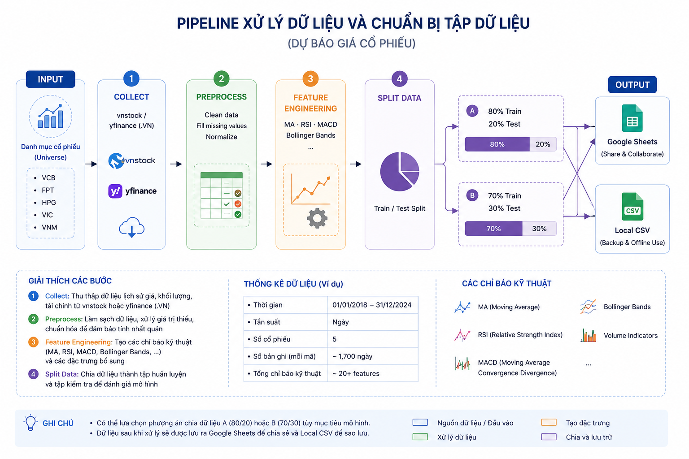

<h1 align="center">📈 Stock Time Series</h1>

<p align="center">
  <b>Open-source research framework for benchmarking time-series forecasting models on Vietnamese stocks</b><br/>
  <i>Collect · Clean · Featurize · Split · Validate · Benchmark · Publish</i>
</p>

<p align="center">
  
  
  
  
  
</p>

---

## Overview

A reproducible benchmark of **seven forecasting models** evaluated under a unified protocol on Vietnamese stock prices: Linear Regression, ARIMA, SVR, LSTM, GRU, Facebook Prophet, and Transformer. The framework is designed for researchers and practitioners who want to compare time-series forecasting methods on the same dataset, splits, and metric definitions.

**Highlights**

- **Three-layer data pipeline** — bronze (raw) → silver (cleaned) → gold (feature-engineered)
- **Two evaluation schemes** — 70/30 and 80/20 single splits plus 5-fold walk-forward cross-validation
- **Five metrics** — RMSE, MAE, MAPE, R², and Directional Accuracy
- **Model registry** — automatic champion tracking per (ticker, split) with promotion / retrain / regression history
- **Production automation** — daily data refresh + weekly heavy-model retrain via GitHub Actions, published to a live dashboard

**Tickers:** `VCB` · `FPT` · `HPG` · `VIC` · `VNM` &nbsp;|&nbsp; **Period:** 2015–2026 (~2 700 sessions / ticker)

---

## Environments

### Production — GitHub Actions (automated)

```
Daily (Mon–Fri 16:00 ICT)
    ↓  collect via yfinance (.VN)               → data/raw/                 (bronze)
    ↓  clean OHLCV gaps + dedup                 → data/processed/cleaned/   (silver)
    ↓  technical indicators (MA/RSI/MACD/BB)    → data/processed/featured/  (gold)
    ↓  train/test split (70/30 and 80/20) + validate (schema, row count, monotonic dates)
    ↓  walk-forward 5-fold benchmark (Linear Regression baseline)
    ↓  re-execute notebooks 01 (Linear Regression) + 04 (ARIMA) + 05 (SVR) + 07 (Prophet) → docs/data/
    ↓  aggregate_results.py → registry.json + chapter5_*.csv
    ↓     ↘ regression check: RMSE +20% vs champion → "regression_detected" event
    ↓  auto-commit docs/data/ + results/ → GitHub Pages auto-deploy
    ↓  upload → Google Sheets ✓
    ↓  on failure → Google Chat webhook (GOOGLE_CHAT_WEBHOOK_URL)

Weekly (Sun 18:00 ICT) — model_retrain.yml
    ↓  pip install -r requirements-heavy.txt    (TensorFlow + PyTorch)
    ↓  full data pipeline (fresh data for fairness)
    ↓  re-execute notebook 03 (LSTM/GRU) + 08 (Transformer)
    ↓  aggregate + auto-commit → Pages auto-deploy
```

Heavy deep-learning models (~10–30 min per notebook) are split into the weekly job to keep daily compute light while preserving a fair, same-snapshot comparison across all models.

**Optional secrets** (GitHub repo → Settings → Secrets → Actions):
- `GOOGLE_SERVICE_ACCOUNT_JSON`, `SHEETS_SPREADSHEET_ID` — Sheets upload
- `GOOGLE_CHAT_WEBHOOK_URL` — failure alerts to a Google Chat space

---

### Development — Run locally

```bash
git clone https://github.com/PhongNguyenTrung/stock-time-series.git
cd stock-time-series

python3 -m venv .venv
source .venv/bin/activate          # Windows: .venv\Scripts\activate
pip install -r requirements.txt
# pip install -r requirements-heavy.txt   # only if running notebook 03 (LSTM/GRU) or 08 (Transformer)
```

Configure `.env` (defaults sufficient):

```bash
cp .env.example .env
```

Run the data pipeline:

```bash
python scripts/run_pipeline.py --skip-upload --skip-sheets             # standard local run
python scripts/run_pipeline.py --skip-upload --skip-sheets --force     # force re-download
```

Output layout:

```
data/
├── raw/                          # Raw OHLCV                          [git-ignored]
└── processed/
    ├── cleaned/                  # Clean OHLCV (silver)               [git-ignored]
    ├── featured/                 # + indicators (gold)                [git-ignored]
    └── splits/
        ├── 70_30/                # 5 tickers × {train,test}.csv = 10 files
        ├── 80_20/                # 10 files
        └── split_info.json       # cut dates per ticker
```

Load data in a notebook:

```python
import pandas as pd
from pathlib import Path

SPLITS_DIR = Path("data/processed/splits")
train = pd.read_csv(SPLITS_DIR / "70_30/VCB_train.csv", parse_dates=["date"])
test  = pd.read_csv(SPLITS_DIR / "70_30/VCB_test.csv",  parse_dates=["date"])
```

---

## Pipeline




| Step | Module | Output |
|------|--------|--------|
| 1 · Collect (bronze) | `src/collect.py` | `data/raw/<TICKER>.csv` |
| 2 · Clean (silver) | `src/clean.py` | `data/processed/cleaned/<TICKER>.csv` |
| 3 · Features (gold) | `src/features.py` | `data/processed/featured/<TICKER>_featured.csv` |
| 4 · Validate | `src/validate.py` | exit non-zero on schema / row / monotonicity failure |
| 5 · Split | `src/split.py` | `data/processed/splits/{70_30,80_20}/<TICKER>_{train,test}.csv` |
| 6 · Sheets upload | `src/sheets.py` | Google Sheets (production only) |

---

## Dataset schema

Columns in each `*_train.csv` / `*_test.csv`:

| Column | Type | Description |
|--------|------|-------------|
| `date` | date | Trading date |
| `open` `high` `low` `close` | float | OHLC price (VND thousands) |
| `volume` | int | Matched trading volume |
| `ma_5` `ma_20` `ma_50` | float | Simple Moving Average |
| `rsi_14` | float | RSI (0–100) |
| `macd` `macd_signal` `macd_hist` | float | MACD (12, 26, 9) |
| `bb_upper` `bb_middle` `bb_lower` | float | Bollinger Bands (20, 2σ) |

**Split boundaries** (consistent across all tickers; exact values in `data/processed/splits/split_info.json`):

| Split | Train end | Test start | Train rows | Test rows |
|-------|-----------|------------|------------|-----------|
| 70/30 | 2023-02-24 | 2023-02-27 | 1 856 | 796 |
| 80/20 | 2024-03-18 | 2024-03-19 | 2 121 | 531 |

---

## Notebooks

| Notebook | Model / purpose |
|----------|-----------------|
| `00_template.ipynb` | Template for adding a new model |
| `01_linear_regression.ipynb` | Linear Regression baseline (OLS + lag features + indicators) |
| `02_eda.ipynb` | Exploratory data analysis |
| `03_lstm_gru.ipynb` | LSTM and GRU recurrent networks |
| `04_ARIMA.ipynb` | ARIMA / SARIMA |
| `05_SVR.ipynb` | Support Vector Regression |
| `07_facebook_prophet.ipynb` | Facebook Prophet |
| `08_transformer.ipynb` | Transformer (attention-based) |

### Adding a new model

1. Copy `00_template.ipynb` and rename it (e.g. `09_xgboost.ipynb`).
2. Set `MODEL_NAME` and implement `train_and_predict()` / `prepare_data()`.
3. Use the shared metric helper to guarantee identical formulas across models:

   ```python
   from src.metrics import compute_metrics

   # y_true, y_pred:  next-day close (test set, original price space)
   # prev_close:      same-day close (used for Directional Accuracy)
   m = compute_metrics(y_true, y_pred, prev_close=prev_close)
   rows.append({"Ticker": "VCB", "Split": "70_30", "Model": MODEL_NAME, **m})
   ```

4. Save results to `results/<model_slug>/<model_slug>_results.csv` with schema:

   ```
   Ticker,Split,Model,RMSE,MAE,MAPE (%),R²,Directional Accuracy (%)
   VCB,70_30,XGBoost,0.91,0.62,1.05,0.94,52.1
   ...
   ```

The aggregator picks up every `*_results.csv` it finds under `results/`, so no further wiring is required.

### Aggregate & compare

```bash
python scripts/aggregate_results.py
# → results/comparison/chapter5_comparison.csv               main pivot
# → results/comparison/chapter5_pivot_{rmse,mae}_*.csv       per-metric pivots
# → results/comparison/chapter5_walkforward_summary.csv      walk-forward CV
# → results/comparison/plots/                                bar / heatmap / rank PNGs
# → results/registry.json                                    champion model + promotion history
```

### Walk-forward benchmark (Linear Regression)

`TimeSeriesSplit` 5-fold expanding window — the academic standard for time-series cross-validation:

```bash
python scripts/walkforward_eval.py
# → results/linear_regression/linear_regression_walkforward.csv          per fold
# → results/linear_regression/linear_regression_walkforward_summary.csv  mean ± std
```

The aggregator also picks up any `*_walkforward.csv` under `results/`, so additional models can ship their own walk-forward CSVs without script changes.

### Model registry

`results/registry.json` tracks the lowest-RMSE model per `(Ticker, Split)` with a chronological history of `initial`, `promote`, `retrain`, and `regression_detected` events. Updated automatically by `aggregate_results.py`.

---

## Tech stack

| Library | Purpose |
|---------|---------|
| [vnstock](https://github.com/thinh-vu/vnstock) | Vietnamese stock data (primary) |
| [yfinance](https://github.com/ranaroussi/yfinance) | Fallback when VCI is blocked |
| [pandas](https://pandas.pydata.org/), numpy | Data manipulation |
| [ta](https://github.com/bukosabino/ta) | Technical indicators |
| [scikit-learn](https://scikit-learn.org/) | Linear Regression, SVR, StandardScaler, TimeSeriesSplit |
| [statsmodels](https://www.statsmodels.org/) | ARIMA, ADF test, seasonal decomposition |
| [Prophet](https://facebook.github.io/prophet/) | Facebook Prophet (`requirements.txt`) |
| [TensorFlow / Keras](https://www.tensorflow.org/) | LSTM, GRU (`requirements-heavy.txt`) |
| [PyTorch](https://pytorch.org/) | Transformer (`requirements-heavy.txt`) |
| [gspread](https://github.com/burnash/gspread), google-auth | Google Sheets API |
| [jupyter](https://jupyter.org/), nbconvert | Notebook execution in CI |

---

## License

MIT
