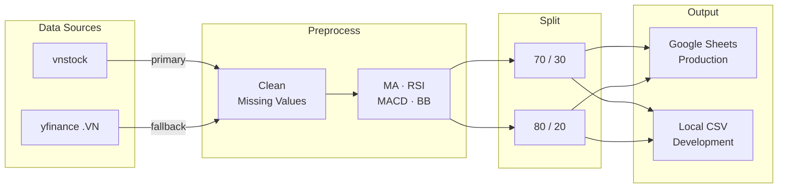

<h1 align="center">📈 Stock Time Series</h1>

<p align="center">
  <b>Vietnamese stock market data pipeline for time series forecasting research</b><br/>
  <i>Collect · Preprocess · Engineer Features · Split · Share</i>
</p>

<p align="center">
  
  
  
  
</p>

---

## Overview

Member 1's data pipeline for a group project on Vietnamese stock price forecasting.
Delivers clean, reproducible datasets that feed into six forecasting models built by other team members: ARIMA, SVR, LSTM, GRU, Prophet, and XGBoost/Transformer.

**Tickers:** `VCB` · `FPT` · `HPG` · `VIC` · `VNM` &nbsp;|&nbsp; **Period:** 2016 – 2026

---

## Environments

### Production — GitHub Actions (automated)

Runs automatically every weekday (Mon–Fri) at **4:00 PM Vietnam time** (after HOSE/HNX market close).
Results are pushed to **Google Sheets** — teammates open the link to get the latest data.

```
GitHub Actions (cron Mon–Fri 16:00 ICT)
    ↓  collect via yfinance (.VN)
    ↓  preprocess + feature engineering
    ↓  train/test split (70/30 and 80/20)
    ↓  upload → Google Sheets ✓
```

> **Google Sheets link:** *(add link here after setup)*

---

### Development — Run locally

Clone the repo and run the pipeline on your machine to generate CSV files under `data/processed/splits/`.

#### 1. Clone & set up the environment

```bash
git clone https://github.com/PhongNguyenTrung/stock-time-series.git
cd stock-time-series

python3 -m venv .venv
source .venv/bin/activate          # Windows: .venv\Scripts\activate
pip install -r requirements.txt
```

#### 2. Configure `.env`

```bash
cp .env.example .env
```

The defaults in `.env.example` are sufficient to run — no changes needed.

#### 3. Run the pipeline

```bash
# Standard local run (skips cloud uploads)
python scripts/run_pipeline.py --skip-upload --skip-sheets

# Force re-download of raw data
python scripts/run_pipeline.py --skip-upload --skip-sheets --force
```

The pipeline produces:

```
data/
├── raw/                          # Raw OHLCV             [git-ignored]
└── processed/
    ├── featured/                 # + indicators           [git-ignored]
    └── splits/
        ├── 70_30/
        │   ├── VCB_train.csv
        │   ├── VCB_test.csv
        │   └── ...               # 5 tickers × 2 files = 10 files
        ├── 80_20/
        │   └── ...               # 10 files
        └── split_info.json       # cut dates per ticker
```

#### 4. Load data in a notebook

```python
import pandas as pd
from pathlib import Path

SPLITS_DIR = Path("data/processed/splits")

train = pd.read_csv(SPLITS_DIR / "70_30/VCB_train.csv", parse_dates=["date"])
test  = pd.read_csv(SPLITS_DIR / "70_30/VCB_test.csv",  parse_dates=["date"])
```

---

## Pipeline



| Step | Module | Output |
|------|--------|--------|
| 1 · Collect | `src/collect.py` | `data/raw/<TICKER>.csv` |
| 2 · Preprocess | `src/preprocess.py` | `data/processed/featured/<TICKER>_featured.csv` |
| 3 · Split | `src/split.py` | `data/processed/splits/{70_30,80_20}/<TICKER>_{train,test}.csv` |
| 4 · Upload | `src/sheets.py` | Google Sheets (production only) |

---

## Dataset Schema

Columns in each `*_train.csv` / `*_test.csv` file:

| Column | Type | Description |
|--------|------|-------------|
| `date` | date | Trading date |
| `open` `high` `low` `close` | float | OHLC price (VND thousands) |
| `volume` | int | Matched trading volume |
| `ma_5` `ma_20` `ma_50` | float | Simple Moving Average |
| `rsi_14` | float | RSI (0–100) |
| `macd` `macd_signal` `macd_hist` | float | MACD (12, 26, 9) |
| `bb_upper` `bb_middle` `bb_lower` | float | Bollinger Bands (20, 2σ) |

**Split boundaries** (identical across all tickers):

| Split | Train end | Test start | Train rows | Test rows |
|-------|-----------|------------|------------|-----------|
| 70/30 | 2023-02-21 | 2023-02-22 | ~1 854 | ~796 |
| 80/20 | 2024-03-14 | 2024-03-15 | ~2 120 | ~530 |

---

## Tech Stack

| Library | Purpose |
|---------|---------|
| [vnstock](https://github.com/thinh-vu/vnstock) | Vietnamese stock data |
| [yfinance](https://github.com/ranaroussi/yfinance) | Fallback data source |
| [pandas](https://pandas.pydata.org/) | Data manipulation |
| [ta](https://github.com/bukosabino/ta) | Technical indicators |
| [gspread](https://github.com/burnash/gspread) | Google Sheets API |

---

## License

MIT © [PhongNguyenTrung](https://github.com/PhongNguyenTrung)
